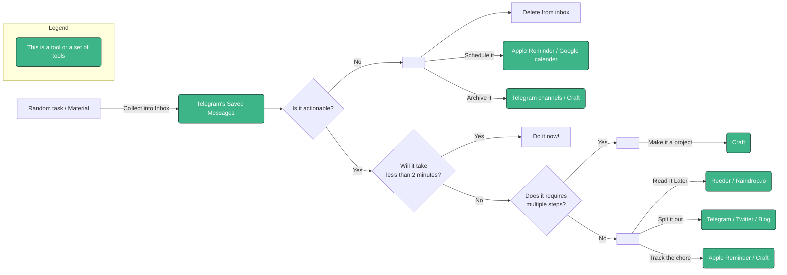

# My GTD flow

This repo records the GTD flow I got, and the tool I use revolving around it.

```mermaid
graph LR
  item[Random task / Material] -- Collect into Inbox --> inbox_tool(Telegram's Saved Messages)

  inbox_tool --> actionable{Is it actionable?}

  actionable -- No --> sort[ ]
  actionable -- Yes --> two_min_rule{Will it take<br/>less than 2 minutes?}

  sort --> delete[Delete from inbox]
  sort -- Schedule it --> schedule_tool(Apple Reminder / Google calender)
  sort -- Archive it --> archive_tool(Telegram channels / Craft)

  two_min_rule -- Yes --> do_it[Do it now!]
  two_min_rule -- No --> multiple_step{Does it requires<br/>multiple steps?}

  multiple_step -- Yes --> sort2[ ]
  multiple_step -- No --> sort3[ ]
  
  sort2 -- Make it a project --> project_tool(Craft)

  sort3 -- Read It Later --> read_it_later_tool(Reeder / Raindrop.io)
  sort3 -- Spit it out --> social_tool(Telegram / Twitter / Blog)
  sort3 -- Track the chore --> chore_tool(Apple Reminder / Craft)

  subgraph Legend
    tool(This is a tool or a set of tools)

  end
  
  style inbox_tool fill:#3EB489,stroke:#001811,color:#fff
  style schedule_tool fill:#3EB489,stroke:#001811,color:#fff
  style archive_tool fill:#3EB489,stroke:#001811,color:#fff
  style project_tool fill:#3EB489,stroke:#001811,color:#fff
  style read_it_later_tool fill:#3EB489,stroke:#001811,color:#fff
  style social_tool fill:#3EB489,stroke:#001811,color:#fff
  style chore_tool fill:#3EB489,stroke:#001811,color:#fff
  style tool fill:#3EB489,stroke:#001811,color:#fff
```
